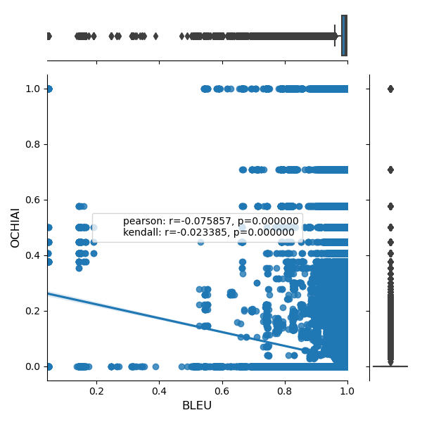

# Technical paper - ICSE 2022

## Empirical evaluation

### RQ1

> Many seeded faults behave quite similarly to real faults (high semantic similarity) while at the same time having low syntactical similarity to real faults. Perhaps surprisingly, we find no evidence suggesting any link between syntactic and semantic similarity, except from the cases of exact matches.

```
Class granularity level (PiTest - CodeBERT - DeepMutation - IBIR)
```

<p float="center">
  
   
  
  
</p>
  
### RQ2

### RQ3


### Support or Contact

Check our [Git-Repo](https://github.com/mutationtesting-user/bugs_vs_mutants)

