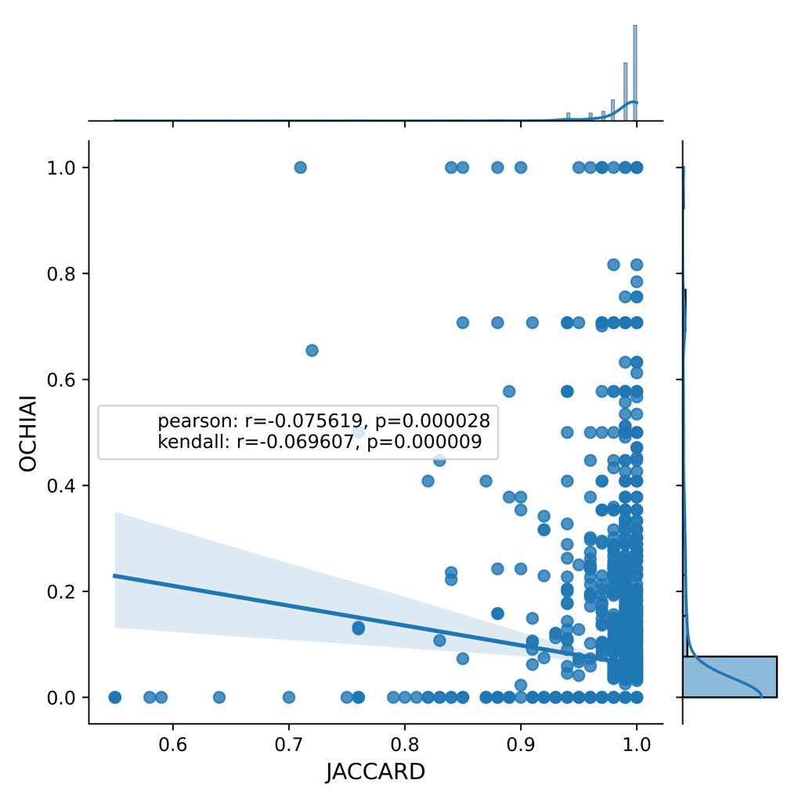

# Technical paper - ICSE 2022 - Supplementary data

## Empirical evaluation 

### RQ1

> Many seeded faults behave quite similarly to real faults (high semantic similarity) while at the same time having low syntactical similarity to real faults. Perhaps surprisingly, we find no evidence suggesting any link between syntactic and semantic similarity, except from the cases of exact matches.

### Results - Cosine Coefficient
```
Class granularity level (PiTest - CodeBERT - DeepMutation - IBIR)
```

<p float="center">
  
   
  
  
</p>

```
Function granularity level (PiTest - CodeBERT - DeepMutation - IBIR)
```
<p float="center">
  
   
  
  
</p>

### Results - Jaccard Coefficient
```
Class granularity level (PiTest - CodeBERT - DeepMutation - IBIR)
```

<p float="center">
  
   
  
  
</p>

```
Function granularity level (PiTest - CodeBERT - DeepMutation - IBIR)
```
<p float="center">
  
   
  
  
</p>

  
### Discussion

> Sensitivity of mutants from the same location. Small syntactic changes lead to diverse semantic changes.

```
Changed lines location (PiTest - CodeBERT - IBIR)
```

<p float="center">
  
   
  
</p>

```
Random lines location (PiTest - CodeBERT - IBIR)
```

<p float="center">
  
   
  
</p>

### Link for rest of data ℹ️ (each .tar file contains ReadMe guidelines with data format and structure)

* 👉 [Download RQ3 data](./data/RQ3/rq3_zip_data.tar.gz)

* 👉 [Download Pit data ](https://drive.google.com/file/d/1SNdo7-XZRXfUNuqCH867HoJGwuNIkPU2/view?usp=sharing) (⚠️ heavy file) 
* 👉 [Download CodeBERT data](https://drive.google.com/file/d/1RLd9ryVT_7JTRp1WARofdUp0ghjpKZ2r/view?usp=sharing) (⚠️ heavy file)
* 👉 [Download DeepMutation data](https://drive.google.com/file/d/1406riXu4rriKEZ814S9zZWn-l5iIo14u/view?usp=sharing) (⚠️ heavy file)
* 👉 [Download IBIR data](https://drive.google.com/file/d/1hc8A_obOm4VAX_bt3F4TNwpyn9n4DSXa/view?usp=sharing) (⚠️ heavy file)


### Support or Contact

Check our [Git-Repo](https://github.com/mutationtesting-user/bugs_vs_mutants) for all descriptive statistics data

