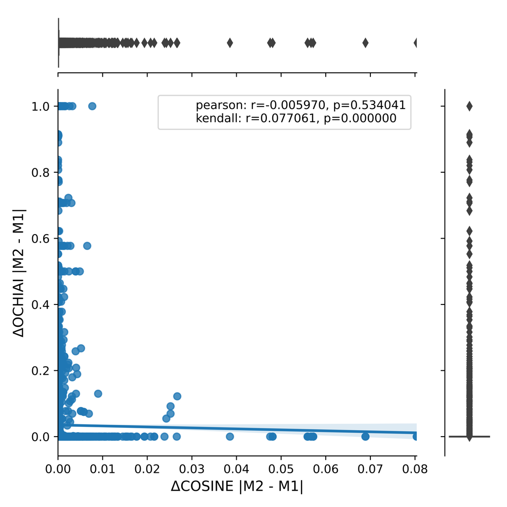

# Journal First - TSE 2022

# Supplementary data

## Empirical evaluation 

### RQ1 - Results per tool

> How semantically and syntactically similar are seeded and real faults?

### BLEU Coefficient - Ochiai score
```
Class granularity level (PiTest - CodeBERT - DeepMutation - IBIR)
```

<p float="center">
  
   
  
  
</p>

### Cosine Coefficient - Ochiai score
```
Class granularity level (PiTest - CodeBERT - DeepMutation - IBIR)
```

<p float="center">
  
   
  
  
</p>

```
Function granularity level (PiTest - CodeBERT - DeepMutation - IBIR)
```
<p float="center">
  
   
  
  
</p>

### Jaccard Coefficient - Ochiai score
```
Class granularity level (PiTest - CodeBERT - DeepMutation - IBIR)
```

<p float="center">
  
   
  
  
</p>

```
Function granularity level (PiTest - CodeBERT - DeepMutation - IBIR)
```
<p float="center">
  
   
  
  
</p>

  
### Discussion

> Sensitivity of mutants from the same location. Small syntactic changes lead to diverse semantic changes.

```
Changed lines location (PiTest - CodeBERT - IBIR)
```

<p float="center">
  
   
  
</p>

```
Random lines location (PiTest - CodeBERT - IBIR)
```

<p float="center">
  
   
  
</p>


> Using Fault Detection Probability instead of Ochiai score for measurement


<p float="center">
  
</p>


<p float="center">
  
</p>

<p float="center">
  
</p>

### Link for rest of data ℹ️ (each .tar file contains ReadMe guidelines with data format and structure)

* 👉 [Download repository with scripts](./scripts.tar.gz)
* 👉 [Download plots](https://drive.google.com/file/d/1AQ7PTvJ0SZM7uVpudD-NLMBF2BgMDpmX/view?usp=sharing)
* 👉 [Download data](https://drive.google.com/file/d/1x9bhZH0i8wuK5cgGwwXf2OLFGJqtA4L1/view?usp=sharing)


* 👉 [Download Pit data ](https://drive.google.com/file/d/1SNdo7-XZRXfUNuqCH867HoJGwuNIkPU2/view?usp=sharing) (⚠️ heavy file) 
* 👉 [Download CodeBERT data](https://drive.google.com/file/d/1RLd9ryVT_7JTRp1WARofdUp0ghjpKZ2r/view?usp=sharing) (⚠️ heavy file)
* 👉 [Download DeepMutation data](https://drive.google.com/file/d/1406riXu4rriKEZ814S9zZWn-l5iIo14u/view?usp=sharing) (⚠️ heavy file)
* 👉 [Download IBIR data](https://drive.google.com/file/d/1hc8A_obOm4VAX_bt3F4TNwpyn9n4DSXa/view?usp=sharing) (⚠️ heavy file)


### Support or Contact

Check our [Git-Repo](https://github.com/mutationtesting-user/bugs_vs_mutants) for all descriptive statistics data

